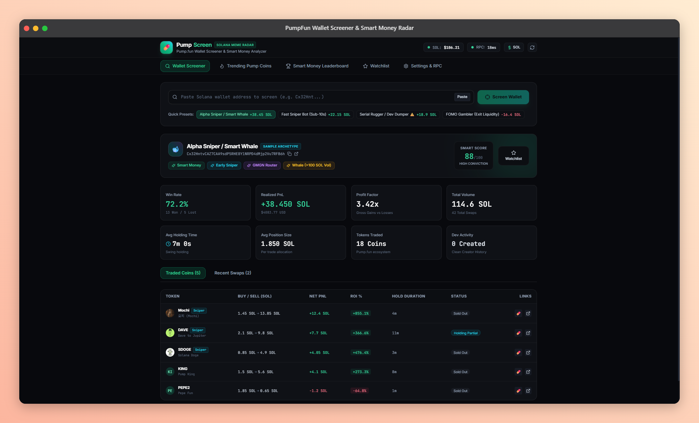

# 💊 PumpScreen

> **Real-time wallet screening and smart-money radar for Pump.fun meme coins on Solana.**

PumpScreen helps you inspect Solana wallets, understand their Pump.fun trading behavior, find active traders behind newly minted tokens, and keep a watchlist of wallets worth monitoring.



> The screenshot is a UI preview. Runtime wallet, token, price, and leaderboard data are fetched from live services; no demo profiles are loaded.

> **Important:** This is an analytics and research tool, not financial advice. Meme coins are highly volatile. Never connect a wallet or risk funds based only on a score, badge, or historical result.

---

## ✨ What can it do?

| Feature | What you get |
| --- | --- |
| **Wallet Screener** | Win rate, realized/unrealized PnL, profit factor, volume, hold time, traded tokens, and recent swaps. |
| **Live Mints** | Newly created Pump.fun tokens from the PumpPortal WebSocket stream. No manual refresh required. |
| **Find Whales** | Inspect recent buyers and sellers for a token, then screen any wallet in one click. |
| **Live Wallet Leaderboard** | Rank wallets discovered from live mint events and on-chain token-trader scans. |
| **Wallet Watchlist** | Save wallets locally in the browser and export the list as JSON. |
| **Custom RPC** | Use a Helius, QuickNode, Alchemy, Shyft, or other Solana RPC endpoint for higher limits. |
| **SOL/USD display** | Toggle between SOL and USD using a live SOL price from DexScreener. |

### Real-data contract

PumpScreen is now real-data-only at runtime:

- **Wallet scans:** every requested wallet is read from Solana Mainnet RPC and parsed from fresh transaction signatures.
- **Market data:** token pairs, prices, volume, and SOL/USD conversion come from DexScreener.
- **Live mint feed:** new token creation events come directly from the PumpPortal WebSocket and are forwarded to the browser over SSE.
- **Live wallet leaderboard:** wallets are discovered from PumpPortal creator events and on-chain token-trader inspections, then ranked only after real transaction history is available.
- **No demo profiles:** the app does not ship or auto-load simulated wallet performance. Empty states are intentional when live history has not been discovered yet.

---

## 🧭 Quick start

### Requirements

- Node.js **18+** (Node 20+ recommended)
- npm
- Internet access to Solana RPC, DexScreener, and PumpPortal

### 1. Clone and install

```bash
git clone https://github.com/dzakyfahrezy1013/Screening-Wallet-Crypto.git
cd Screening-Wallet-Crypto
npm install
```

### 2. Start the app

For the simplest production-style run:

```bash
npm run build
npm start
```

Open **http://localhost:4000**.

For development with Vite hot reload, use two terminals:

```bash
# Terminal 1 — API + live PumpPortal WebSocket
npm run dev:server

# Terminal 2 — React/Vite frontend
npm run dev:client
```

Open **http://localhost:5173**. Vite proxies `/api` requests to the backend on port `4000`.

### 3. Screen a wallet

1. Open **Wallet Screener**.
2. Paste a Solana wallet address.
3. Click **Screen Wallet**.
4. Review the wallet badge, Smart Score, PnL, win rate, hold duration, and token table.
5. Open a transaction or token in Solscan, Pump.fun, or DexScreener for independent verification.

---

## 🧪 Explore the live feed

1. Open **Trending Pump Coins**.
2. Choose **Live Mints (Sub-sec)**.
3. New Pump.fun mints appear with the token symbol, initial buy, market cap, creator wallet, and mint time.
4. Click **Screen Dev** to inspect the creator wallet's on-chain history.

The backend keeps a small in-memory buffer of recent mints and reconnects the PumpPortal WebSocket after a disconnect.

---

## 🧱 How it works

```text
React + Tailwind UI
        │
        ▼
Express REST API ───────────────► DexScreener (prices, pairs, market data)
        │
        ├────────────────────────► Solana Mainnet RPC (wallet transactions)
        │
        └────────────────────────► PumpPortal WebSocket (new Pump.fun mints)
```

### Main directories

```text
src/
  App.jsx                    App state, routing between dashboard tabs, watchlist
  components/                Screener, live feed, leaderboard, settings, tables
server/
  index.js                   Express API, live stream, and wallet discovery
  screener.js                Wallet metrics, PnL aggregation, badges, scoring
  parser.js                  Pump.fun transaction parsing
  liveWallets.js             In-memory registry/cache of observed live wallets
  solanaRpc.js               RPC fallback pool, retry, cache, throttling
  dexscreener.js             SOL price and token market data

### Wallet metrics

PumpScreen derives metrics from parsed transactions, including:

- **Win rate:** profitable closed token positions divided by closed positions.
- **Realized PnL:** sell proceeds minus buy cost for closed positions.
- **Unrealized PnL:** estimated value of remaining tokens using current market data.
- **Profit factor:** gross profits divided by gross losses.
- **Average hold duration:** elapsed time between the first buy and final sell/current observation.
- **Smart Score:** a heuristic indicator based on profitability, win rate, profit factor, and risk signals.

Scores and badges are analytical heuristics, not guarantees of future performance.

---

## 🔌 API reference

The API runs on `http://localhost:4000` by default.

| Endpoint | Purpose |
| --- | --- |
| `GET /api/health` | API, RPC, SOL price, and PumpPortal WebSocket status. |
| `GET /api/sol-price` | Current SOL/USD price from DexScreener. |
| `GET /api/wallet/:address` | Screen a wallet from fresh Solana Mainnet RPC data. |
| `GET /api/tokens/trending?limit=20` | Fetch trending Solana/Pump.fun pairs. |
| `GET /api/tokens/live-feed` | Read the current live-mint buffer. |
| `GET /api/tokens/live-sse` | Server-Sent Events stream for live mints. |
| `GET /api/token/:mint` | Fetch token market data. |
| `GET /api/token/:mint/traders` | Extract recent traders from token transactions. |
| `GET /api/leaderboard` | Rank wallets discovered from live events and on-chain trader scans. |
| `GET /api/settings/rpc` | Check active RPC and latency. |
| `POST /api/settings/rpc` | Set a custom RPC with `{ "rpcUrl": "https://..." }`. |

Example live wallet request:

curl "http://localhost:4000/api/wallet/<SOLANA_ADDRESS>?limit=50"
```

---

## ⚙️ Custom RPC

Public Solana RPC endpoints can return HTTP `429 Too Many Requests` during batch analysis. Open **Settings & RPC** and provide a private endpoint when screening frequently.

Good options include:

- [Helius](https://www.helius.dev/)
- [QuickNode](https://www.quicknode.com/)
- [Alchemy](https://www.alchemy.com/)
- [Shyft](https://shyft.to/)

The app keeps RPC configuration in memory for the running server. Do not commit API keys to the repository.

---

## 🛠️ Configuration

Optional environment variables:

```text
PORT=4000
SOLANA_RPC_URL=https://your-rpc.example.com
```

You can also change the RPC from the Settings screen without editing files.

---

## ✅ Verification

The project has been verified with:

```bash
npm run build
```

- frontend static serving;
- real wallet screening through Solana RPC;
- DexScreener trending tokens;
- PumpPortal live token feed;
- SSE delivery of newly minted tokens;
- token trader inspection and live wallet discovery;
- empty-state behavior when no real leaderboard history is available;
- browser tab navigation and live-feed rendering.

---

## ⚠️ Data and risk notes

- Public RPC providers may throttle requests or return incomplete transaction batches.
- Some transactions cannot be classified perfectly from public parsed RPC responses, especially aggregator or bot-routed swaps.
- Token prices, liquidity, and market caps can change rapidly.
- A high historical win rate does not mean a wallet is safe to copy.
- Never expose private keys or seed phrases. PumpScreen does not need them.

---

## 📄 License

No license has been declared yet. Add a license before distributing the project for reuse.
